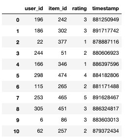
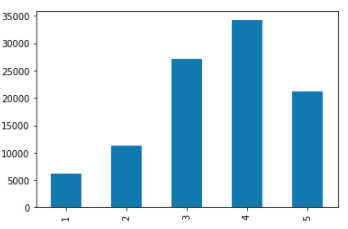
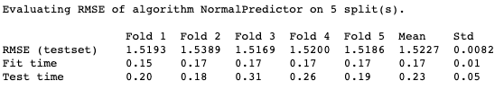
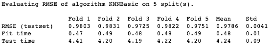
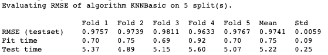
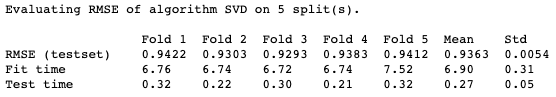
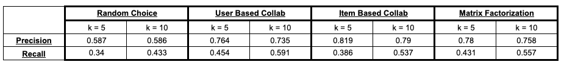

# Netflix Style Movie Recommendation Systems

## Using MovieLens opendata set

Let's build a movie recommendation system to aid in your choice paralysis syndrome.

We will use the python "Suprise" package to help build and evaluate our recommendation systems.

There is a built in dataset of 100,000 movie ratings given by various users.  The data looks something like this:

So reading columns left to right there is user_id which is self explanatory, item_id which would be a particular movie, rating of the movie by given user and timestamp.

Here is histogram showing the distribution of ratings:

As you can see the distribution is skewed to the right.

In the dataset, there are 943 unique users and 1,682 unique movies.

## Model Evaluation

We will be comparing four types of recomendation systems:
1. "Random Choice" based on current distribution of ratings
2. User Based Collaborative Filtering
3. Item Based Collaborative Filtering
4. Matrix Factorization

We will also implement k-fold cross validation to address under / over fitting of the training data.  With a k value of 5, we will hold out a different 20% of the data on each of the 5 runs to test the model trained on the remaining 80%.  

Here is a summary of the Random Choice recommendation system:

The mean RMSE (Root Mean Square Error) is about 1.5, which is a measure of the standard deviation of the residuals (prediction errors).

This will serve as a baseline to compare the other recommendation systems to.  Hopefully we can create a better system than a random number generator.

Next up is the User Based Collaborative Filtering model:

As you can see the fit and test time has gone up due to the increased complexity of the model, but the RMSE has decreased significantly.

In a sense, this approach uses the similarity between users and their preferences to estimate the ratings for movies that users have not seen yet.

Next we have Item Based Collaborative Filtering that looks at the similarity between the movies rather than the users.

The RMSE is comparable to the user based method, however the fit and test times are higher probably due to that fact that there are more movies than users resulting in more comparisons therefore more calculations and time.

Up last is the Matrix Factorization method:

Matrix Factorization takes a more global approach to estimating the similarity matrix rather than a more local neighborhood approach taken by the collaborative filtering models.

Another interesting difference is the fit vs test times.  The collaborative filtereing models had low fit and higher test times due to all the comparisons that are needed to create recommendations for a user.  The matrix factoriation model has a higher up front fit time, but a much quicker test time since the model is already created and just needs to be evaluated per user.

The RMSE is lower for the Matrix Factorization model by about 5% than the collaborative filtering models possible due to the more global approach.

## Precision and Recall Model Evaluation at different K values

We will evaluate each of these models at different k values (not the cross validation k value lol).  We will evaluate at k = 5 and k = 10, meaning top 5 recommendations and top 10 recommendations.

We evaluate if a recommendation is a hit or not, or more technically "relevant", by using an initial threshold of 3.5

This allows us to make a binary classification to help evaluate the precision and recall of our models.

Precision is calculated as True Positives / (True Positives + False Positives)

or can be read as "When my model classifies something as true, how often is it actually true?"

Recall is calculated as True Positives / (True Positives + False Negatives)

or can be read as "What percentage of all the true values did my model capture?"

Precision can be seen as a measure of exactness or quality, whereas recall is a measure of completeness.

Summart of models below:

